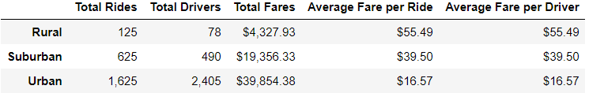
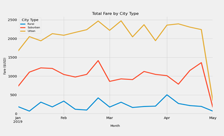

																					

## Overview of the Analysis:

The purpose of this analysis is to take an analytical look at the ride-sharing data by city type. Our goal is to use code within the Panda and Matplotlib framework to create a deeper understanding of fares for each city within our data base. As a result, we will show that these differences can be used by the decision makers at PyBer to make changes that will bring a better value to the company.

## Results:

The first action we took was to separate our data by total rides for each city. By separating this data, we saw the correlation between PyBer services and potential profitability.

As you can see by the data chart above, Rural services are the least active, thus bringing in the least Total Fares of $4327.93. As we focus on the Total Rides and Drivers, we will notice suburban services offer over 200% more drivers, and rides, and thus bring in more than 4 times the amount in total fares. If we look at the Urban data, we see that its numbers have also dwarfed those of Rural and Suburban. The significance of these numbers raises sever questions concerning potential growth and profitability within the other geographic segments. As we know, there are population differences with each demographic area. However, with our recommendations, changes can bring about growth in PyBer’s smaller markets. 

A second look at the data we analyzed led us to the “Total Fares” by each city. Our data frame above, and our graph below shows a stark difference in the total fares by each city.  Unlike Urban and Suburban cities our Rural city data shows a small decline in January before a rise in Total Fares. However, throughout the year, we see small marginable rises and falls with rural city total fares. On the other hand, Suburban and Urban fares show sharp increases and decreases throughout the year showing a greater versatile market in comparison to the smaller rural market.  That is an important finding because, although the total fares are much higher than in Rural areas, the ratio of drivers to total rides and stability of that demographic segment is much more stable allowing a more profitable forecast. Because of this trend, we can prepare a more suitable approach for downturns as seen in the middle of the second quarter. 

## Summary: 

To implement changes that would impact the growth of PyBer we recommended several options to the CEO. 

1.	Create a more stable fare structure within the Urban market segment. 
2.	Allow for Urban drivers to engage in cross market rides opening more total rides.
3.	Identify and implement services in rural growth zones.

As we saw in our Analysis the Urban market segment had the most versatile Fares. By creating a stable Fare structure, we would decrease the rise and fall of fares. We would also allow for drivers to make up in rides across market segments eliminating the need for more routes. As we have seen, there are more drivers than Total Rides. Finally, we would implement new service options in growth zones within the rural market segment, which would continue the stabilized growth and results in Rural cites for PyBer.
